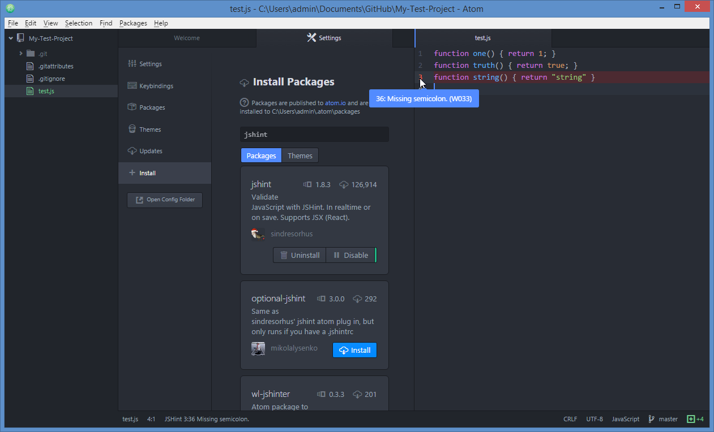

#Using a specialized editor

####Background
Programming can be thought of as a specialized form of writing. Just as Microsoft Word and Google Docs are specialized tools for quickly creating styled text documents, programmers have tools especially suited to their purposes. [Emacs](https://www.gnu.org/software/emacs/) and [Vim](http://www.vim.org/) are powerful tools programmers created to dramatically boost productivity. Unfortunately, both have steep learning curves which aren't necessarily justified for people whose primary role is something other than programming. Luckily, many of the features introduced in these editors have been ported to more user-friendly software. [Sublime Text](http://www.sublimetext.com/) and GitHub's [Atom](https://atom.io/) are both fantastic, highly configurable tools with shallow learning curves. We'll be using Atom because it is entirely free. All of the tools we'll look at can be found in Atom's package management system.

####Important tools
*Syntax highlighting* - In english, we often divide words into types so that we can say something about how the words which make up a sentence relate to one another. So, for instance, we speak of nouns, verbs, and adjectives. Programming languages aren't all that different and it is very useful to be able to see, at a glance, which 'parts of speech' the words in your program belong to. GitHub provides support for syntax highlighting for the most common languages (note that the color choice is arbitrary and may differ from syntax highlighter to syntax highlighter):
```javascript
true // A (light blue) boolean value
"a string" // A (dark blue) string
function one() { return 1; } // A (purple) function name
```

*Linting and Hinting* - Because programming languages are extremely simple for computers to formally reason about, there are powerful tools which catch common bugs and mistakes and even warn you when the style of your code isn't in line with certain best practices. Here, a popular linting engine is installed through Atom's settings and, to the right, we see it warning us that we're missing a semicolon on line 3.  


####Optional tools
*Bracket matching* - Because programmers are constantly writing brackets in their code (e.g. (), [], <>, {}), there are pieces of software which cut this work in half by writing the second bracket for automatically.

*Autocompletion* - As we've already seen, programming languages are far more predictable than natural languages. Because of this, it is possible to infer what the programmer is most likely going to type after they've entered a few letters but before they've finished typing it out.
